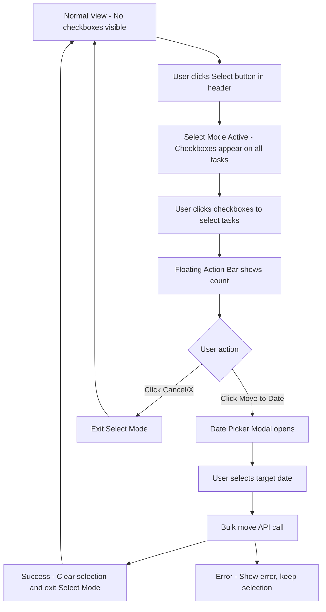

# Bulk Move Tasks Implementation Plan

## Overview

This feature allows users to select multiple tasks across different days and move them all to a target date in a single operation. The selection mode is explicitly activated via a toggle button, keeping the UI clean by default.

## User Flow



## Architecture

### State Management

The bulk selection state will be managed in [`TodoContext.tsx`](frontend/src/context/TodoContext.tsx) to allow cross-day selection:

```typescript
// New state additions to TodoContext
interface BulkSelectionState {
  isSelectMode: boolean;
  selectedTaskIds: Set<string>;
}

// New actions
type TodoAction =
  | ... existing actions ...
  | { type: 'ENTER_SELECT_MODE' }
  | { type: 'EXIT_SELECT_MODE' }
  | { type: 'TOGGLE_TASK_SELECTION'; taskId: string }
  | { type: 'SELECT_ALL_TASKS'; taskIds: string[] }
  | { type: 'CLEAR_SELECTION' };
```

### New Components

1. **BulkActionBar** - Floating action bar component
2. **BulkMoveDatePicker** - Modal with date picker for selecting target date
3. **SelectModeToggle** - Button to enter/exit select mode (in header)

### Modified Components

1. **TaskListContainer** - Add select mode toggle button, render BulkActionBar
2. **TaskItem** - Add selection checkbox (visible only in select mode)
3. **DayContainer** - Pass select mode state to children

## Detailed Implementation

### 1. Backend API Changes

#### New Endpoint: Bulk Move Tasks

**File:** [`backend/src/routes/tasks.ts`](backend/src/routes/tasks.ts:228)

```typescript
// POST /api/tasks/bulk-move
interface BulkMoveRequest {
  taskIds: string[];
  targetDate: string; // ISO date string
}

interface BulkMoveResponse {
  success: boolean;
  movedCount: number;
  tasks: Task[];
  errors?: { taskId: string; error: string }[];
}
```

**File:** [`backend/src/services/taskService.ts`](backend/src/services/taskService.ts)

```typescript
static async bulkMoveTasks(
  userId: string,
  taskIds: string[],
  targetDate: Date
): Promise<{ tasks: Task[]; errors: Array<{ taskId: string; error: string }> }>
```

### 2. Frontend API Changes

**File:** [`frontend/src/services/todoApi.ts`](frontend/src/services/todoApi.ts)

```typescript
interface BulkMoveDTO {
  taskIds: string[];
  targetDate: string;
}

async bulkMoveTasks(data: BulkMoveDTO): Promise<{
  success: boolean;
  movedCount: number;
  tasks: Task[];
}>;
```

### 3. Context Updates

**File:** [`frontend/src/context/TodoContext.tsx`](frontend/src/context/TodoContext.tsx)

Add new state and actions for bulk selection:

```typescript
// State additions
const [isSelectMode, setIsSelectMode] = useState(false);
const [selectedTaskIds, setSelectedTaskIds] = useState<Set<string>>(new Set());

// New context methods
const enterSelectMode = useCallback(() => {
  setIsSelectMode(true);
}, []);

const exitSelectMode = useCallback(() => {
  setIsSelectMode(false);
  setSelectedTaskIds(new Set());
}, []);

const toggleTaskSelection = useCallback((taskId: string) => {
  setSelectedTaskIds(prev => {
    const newSet = new Set(prev);
    if (newSet.has(taskId)) {
      newSet.delete(taskId);
    } else {
      newSet.add(taskId);
    }
    return newSet;
  });
}, []);

const bulkMoveTasks = useCallback(async (targetDate: string) => {
  const taskIds = Array.from(selectedTaskIds);
  const result = await todoApi.bulkMoveTasks({ taskIds, targetDate });
  // Update local state with moved tasks
  // Clear selection and exit select mode
  exitSelectMode();
  return result;
}, [selectedTaskIds, exitSelectMode]);
```

### 4. New Components

#### BulkActionBar Component

**File:** `frontend/src/components/todos/BulkActionBar.tsx`

```typescript
interface BulkActionBarProps {
  selectedCount: number;
  onMoveClick: () => void;
  onCancel: () => void;
  isMoving: boolean;
}
```

Features:
- Fixed position at bottom of screen
- Shows selected task count
- "Move to Date" button opens date picker modal
- "Cancel" button exits select mode
- Smooth slide-up animation when appearing
- Loading state during bulk move operation

#### BulkMoveDatePicker Component

**File:** `frontend/src/components/todos/BulkMoveDatePicker.tsx`

```typescript
interface BulkMoveDatePickerProps {
  isOpen: boolean;
  onClose: () => void;
  onSelectDate: (date: string) => void;
  selectedCount: number;
  isMoving: boolean;
}
```

Features:
- Modal overlay with date input
- Shows count of tasks being moved
- Quick select buttons: "Today", "Tomorrow", "Next Week"
- Confirm and Cancel buttons
- Loading state during move operation

### 5. Component Modifications

#### TaskItem Changes

**File:** [`frontend/src/components/todos/TaskItem.tsx`](frontend/src/components/todos/TaskItem.tsx)

```typescript
interface TaskItemProps {
  // ... existing props
  isSelectMode?: boolean;
  isSelected?: boolean;
  onSelectionToggle?: () => void;
}
```

Changes:
- Add selection checkbox (hidden by default, visible when `isSelectMode` is true)
- Checkbox appears to the left of the drag handle
- Click on checkbox toggles selection
- Visual indication when task is selected (subtle background highlight)

#### TaskListContainer Changes

**File:** [`frontend/src/components/todos/TaskListContainer.tsx`](frontend/src/components/todos/TaskListContainer.tsx)

Changes:
- Add "Select" button in header area (toggles select mode)
- Render BulkActionBar when in select mode and tasks are selected
- Pass select mode state down to DayContainer/TaskItem
- Handle bulk move date picker modal state

#### DayContainer Changes

**File:** [`frontend/src/components/todos/DayContainer.tsx`](frontend/src/components/todos/DayContainer.tsx)

```typescript
interface DayContainerProps {
  // ... existing props
  isSelectMode?: boolean;
  selectedTaskIds?: Set<string>;
  onTaskSelectionToggle?: (taskId: string) => void;
}
```

### 6. Styling

#### New CSS Files

**File:** `frontend/src/components/todos/BulkActionBar.module.css`

```css
.bulkActionBar {
  position: fixed;
  bottom: 0;
  left: 0;
  right: 0;
  background: white;
  border-top: 1px solid var(--todo-border-color);
  padding: 12px 16px;
  display: flex;
  align-items: center;
  justify-content: space-between;
  box-shadow: 0 -2px 10px rgba(0, 0, 0, 0.1);
  z-index: 1000;
  animation: slideUp 0.2s ease-out;
}

@keyframes slideUp {
  from { transform: translateY(100%); }
  to { transform: translateY(0); }
}

/* Mobile: full width, larger touch targets */
@media (max-width: 768px) {
  .bulkActionBar {
    padding: 16px;
  }
}
```

**File:** `frontend/src/components/todos/BulkMoveDatePicker.module.css`

Modal styling with date picker and quick select buttons.

#### TaskItem CSS Updates

**File:** [`frontend/src/components/todos/TaskItem.module.css`](frontend/src/components/todos/TaskItem.module.css)

```css
/* Selection checkbox - hidden by default */
.selectionCheckbox {
  display: none;
  appearance: none;
  width: 18px;
  height: 18px;
  border: 2px solid var(--todo-muted-color);
  border-radius: 4px;
  margin-right: 8px;
  cursor: pointer;
  flex-shrink: 0;
}

/* Show checkbox in select mode */
.selectMode .selectionCheckbox {
  display: block;
}

/* Selected state */
.selectionCheckbox:checked {
  background-color: var(--button-primary-bg);
  border-color: var(--button-primary-bg);
}

/* Selected task highlight */
.taskItem.selected {
  background-color: rgba(37, 99, 235, 0.08);
}
```

#### TaskListContainer CSS Updates

**File:** [`frontend/src/components/todos/TaskListContainer.module.css`](frontend/src/components/todos/TaskListContainer.module.css)

```css
/* Select mode toggle button */
.selectModeButton {
  display: flex;
  align-items: center;
  gap: 4px;
  padding: 6px 12px;
  border: 1px solid var(--todo-border-color);
  border-radius: var(--radius-sm);
  background: transparent;
  color: var(--todo-text-color);
  cursor: pointer;
  font-size: 13px;
  transition: all var(--transition-fast);
}

.selectModeButton:hover {
  background-color: var(--button-secondary-bg);
}

.selectModeButton.active {
  background-color: var(--button-primary-bg);
  color: white;
  border-color: var(--button-primary-bg);
}
```

## File Changes Summary

### New Files
| File | Description |
|------|-------------|
| `frontend/src/components/todos/BulkActionBar.tsx` | Floating action bar component |
| `frontend/src/components/todos/BulkActionBar.module.css` | Styles for action bar |
| `frontend/src/components/todos/BulkMoveDatePicker.tsx` | Date picker modal |
| `frontend/src/components/todos/BulkMoveDatePicker.module.css` | Styles for date picker modal |

### Modified Files
| File | Changes |
|------|---------|
| `backend/src/routes/tasks.ts` | Add bulk move endpoint |
| `backend/src/services/taskService.ts` | Add bulkMoveTasks method |
| `frontend/src/services/todoApi.ts` | Add bulkMoveTasks API call |
| `frontend/src/context/TodoContext.tsx` | Add selection state and bulk move logic |
| `frontend/src/components/todos/TaskListContainer.tsx` | Add select mode toggle, render action bar |
| `frontend/src/components/todos/TaskListContainer.module.css` | Add select button styles |
| `frontend/src/components/todos/DayContainer.tsx` | Pass selection props to TaskItem |
| `frontend/src/components/todos/TaskItem.tsx` | Add selection checkbox |
| `frontend/src/components/todos/TaskItem.module.css` | Add checkbox and selected state styles |

## Testing Considerations

### Unit Tests
- TodoContext: Test selection state management
- BulkActionBar: Test rendering and button clicks
- BulkMoveDatePicker: Test date selection
- TaskItem: Test checkbox visibility and selection toggle

### Integration Tests
- Full flow: Enter select mode -> select tasks -> move -> verify state cleared
- Error handling: API failure keeps selection intact
- Cross-day selection: Select tasks from multiple days

### Edge Cases
- Moving tasks to the same day they're already on
- Moving completed vs incomplete tasks
- Empty selection (action bar shouldn't appear)
- Very large selections (performance)

## Implementation Order

1. **Backend API** - Add bulk move endpoint and service method
2. **Frontend API** - Add bulkMoveTasks to todoApi
3. **Context Updates** - Add selection state and methods to TodoContext
4. **TaskItem Updates** - Add selection checkbox (hidden by default)
5. **TaskListContainer Updates** - Add select mode toggle button
6. **BulkActionBar Component** - Create floating action bar
7. **BulkMoveDatePicker Component** - Create date picker modal
8. **Styling** - Polish all CSS for both desktop and mobile
9. **Testing** - Add unit and integration tests

## Accessibility Considerations

- Keyboard navigation: Tab through checkboxes, Enter to toggle
- Screen reader: Announce selection count changes
- Focus management: Return focus appropriately after modal closes
- ARIA labels on all interactive elements