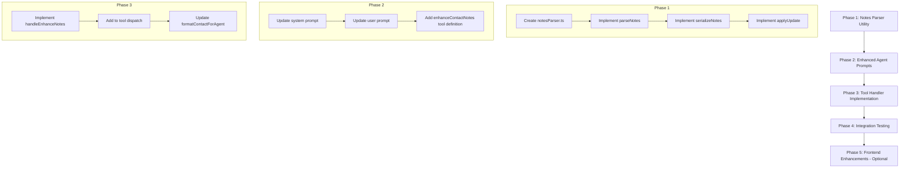

# CRM Notes Enhancement Implementation Plan

## Overview

This plan outlines the implementation of an intelligent notes enhancement feature for the email integration agent. The agent will continuously analyze incoming emails and automatically enrich contact notes with high-confidence, high-signal information following a structured markdown format.

## Current State Analysis

### Existing Architecture

1. **Email Analysis Agent** ([`backend/src/services/emailAnalysisAgent.ts`](backend/src/services/emailAnalysisAgent.ts))
   - Uses OpenRouter API with Claude Sonnet for email analysis
   - Implements tool-based agent pattern with `lookupContactByEmail`, `createContact`, and `updateContactField` tools
   - Currently extracts basic contact info: name, company, title from signatures
   - Can update the `notes` field but lacks structured guidance

2. **Contact Model** ([`backend/prisma/schema.prisma:119-141`](backend/prisma/schema.prisma:119))
   - `notes` field is a simple nullable String
   - Version history tracked via `ContactVersion` model with JSON snapshots
   - Changes between versions computed and stored

3. **Contact Service** ([`backend/src/services/contactService.ts`](backend/src/services/contactService.ts))
   - Full CRUD operations with version tracking
   - `updateContact()` automatically creates version snapshots
   - `computeChanges()` tracks field-level diffs

4. **Email Action Handler** ([`backend/src/services/emailActionHandler.ts`](backend/src/services/emailActionHandler.ts))
   - Entry point for processing new emails
   - Determines email direction (sent/received)
   - Invokes `EmailAnalysisAgent.analyzeEmail()`

## Design Decisions

Based on requirements discussion:

| Decision | Choice |
|----------|--------|
| Contact Classification | Unified structure for all contacts |
| Notes Storage | Single text field with structured markdown |
| Confidence Level | High-confidence explicit + inferred information |
| Update Strategy | Intelligent merge for sections, append for history |
| User Review | Automatic updates with history tracking for review |

## Structured Notes Format

The notes field will follow this markdown structure:

```markdown
## RELATIONSHIP SUMMARY
- **Role in our world:** [decision-maker/influencer/champion/connector/etc.]
- **How we met:** [introduction source or first contact context]
- **Relationship owner:** [team member name if applicable]

## WHAT THEY CARE ABOUT
- **Goals/KPIs:** [their objectives]
- **Main pains:** [challenges they face]
- **Hot buttons:** [topics that engage them]

## KEY HISTORY
- YYYY-MM-DD - [interaction summary]
- YYYY-MM-DD - [interaction summary]

## CURRENT STATUS
- **Where things stand:** [current relationship state]
- **Risks/blockers:** [any concerns]
- **Next step:** [action item + timing]

## PREFERENCES & NOTES
- **Communication:** [preferred channels, timing]
- **Style:** [high-level vs detail, async vs meetings]
- **Landmines:** [topics to avoid]
- **Personal:** [rapport-building details - non-creepy]
```

## Implementation Plan

### Phase 1: Enhanced Notes Tool and Parser

#### 1.1 Create Notes Parser Utility

**File:** `backend/src/utils/notesParser.ts`

```typescript
interface ParsedNotes {
  relationshipSummary: {
    role?: string;
    howWeMet?: string;
    relationshipOwner?: string;
  };
  whatTheyCareAbout: {
    goals?: string[];
    pains?: string[];
    hotButtons?: string[];
  };
  keyHistory: Array<{
    date: string;
    summary: string;
  }>;
  currentStatus: {
    whereThingsStand?: string;
    risks?: string[];
    nextStep?: string;
  };
  preferences: {
    communication?: string;
    style?: string;
    landmines?: string[];
    personal?: string[];
  };
}
```

**Functions:**
- `parseNotes(markdown: string): ParsedNotes` - Parse existing notes into structured object
- `serializeNotes(parsed: ParsedNotes): string` - Convert structured object back to markdown
- `mergeNotes(existing: ParsedNotes, updates: Partial<ParsedNotes>): ParsedNotes` - Intelligently merge updates

#### 1.2 Create Notes Enhancement Tool

**File:** `backend/src/services/emailAnalysisAgent.ts` (enhanced)

Add new tool definition:

```typescript
{
  type: 'function',
  function: {
    name: 'enhanceContactNotes',
    description: 'Add high-confidence information to contact notes. Use this to record relationship context, preferences, key interactions, and insights learned from emails.',
    parameters: {
      type: 'object',
      properties: {
        contactId: { type: 'string' },
        section: {
          type: 'string',
          enum: ['relationshipSummary', 'whatTheyCareAbout', 'keyHistory', 'currentStatus', 'preferences'],
        },
        field: { type: 'string' },
        value: { type: 'string' },
        confidence: {
          type: 'string',
          enum: ['explicit', 'inferred'],
          description: 'Whether this was explicitly stated or inferred from context',
        },
        source: {
          type: 'string',
          description: 'Brief description of where this information was found in the email',
        },
      },
      required: ['contactId', 'section', 'field', 'value', 'confidence', 'source'],
    },
  },
}
```

### Phase 2: Enhanced Agent Prompts

#### 2.1 Update System Prompt

The system prompt needs significant enhancement to guide the agent on what information to extract:

```typescript
const systemPrompt = `You are an email analysis agent for a CRM system. Your job is to:

1. CONTACT MANAGEMENT
   - Extract sender email and look up existing contact
   - Create new contacts for unknown senders (skip automated emails)
   - Update basic fields (name, company, title) from signatures

2. NOTES ENHANCEMENT (PRIMARY FOCUS)
   Analyze each email for high-signal information to add to contact notes.
   Only record HIGH-CONFIDENCE information - things explicitly stated or clearly inferable.

   WHAT TO CAPTURE:

   A. Relationship Context
      - How you connected (if mentioned: "Great meeting you at...")
      - Their role/influence level (decision-maker, champion, blocker)
      - Who introduced them or how they found you

   B. What They Care About
      - Goals they mention ("We're trying to improve...")
      - Pain points ("Our biggest challenge is...")
      - Topics that engage them (what they ask about, emphasize)

   C. Key Interactions (add dated entries)
      - Important requests or asks
      - Commitments made (by them or to them)
      - Decisions or outcomes ("We've decided to...")
      - Significant updates to the relationship

   D. Current Status
      - Where things stand in any ongoing discussion
      - Blockers or risks mentioned
      - Next steps discussed

   E. Preferences & Personal
      - Communication preferences (if stated: "Best to reach me by...")
      - Working style hints (detail-oriented, prefers brevity, etc.)
      - Personal details for rapport (mentioned hobbies, family, etc.)
      - Things to avoid (complaints, sensitivities)

   WHAT NOT TO CAPTURE:
   - Gossip or subjective judgments
   - Sensitive personal information
   - Anything discriminatory
   - Low-confidence guesses
   - Routine pleasantries

   CONFIDENCE LEVELS:
   - "explicit": Directly stated in the email
   - "inferred": Clearly implied by context (e.g., signature shows title)

3. GUIDELINES
   - Be factual and professional
   - Date all history entries (use email date)
   - Keep entries concise but informative
   - Preserve existing notes - add to them, don't replace
   - Skip if no high-signal information found

Current context:
- User ID: ${userId}
- Account Email: ${accountEmail}
- Today's Date: ${new Date().toISOString().split('T')[0]}`;
```

#### 2.2 Update User Prompt

```typescript
const userPrompt = `Analyze this email and update CRM contacts:

From: ${message.from || 'Unknown'}
To: ${message.to || 'Unknown'}
Subject: ${message.subject || '(No Subject)'}
Date: ${message.date || 'Unknown'}

Email Body:
${emailBody}

INSTRUCTIONS:
1. Look up the sender contact (or create if new)
2. Analyze for high-signal information to add to notes:
   - Relationship context clues
   - Goals, pains, interests mentioned
   - Key interaction details worth recording
   - Status updates on any ongoing matters
   - Communication preferences or personal details
3. Use enhanceContactNotes for each piece of valuable information
4. Skip routine emails with no notable content`;
```

### Phase 3: Tool Handler Implementation

#### 3.1 Implement enhanceContactNotes Handler

**In:** `backend/src/services/emailAnalysisAgent.ts`

```typescript
private static async handleEnhanceNotes(
  userId: string,
  args: {
    contactId: string;
    section: string;
    field: string;
    value: string;
    confidence: 'explicit' | 'inferred';
    source: string;
  }
): Promise<string> {
  console.log(`[Tool] enhanceContactNotes:`);
  console.log(`  Contact ID: ${args.contactId}`);
  console.log(`  Section: ${args.section}`);
  console.log(`  Field: ${args.field}`);
  console.log(`  Value: ${args.value}`);
  console.log(`  Confidence: ${args.confidence}`);
  console.log(`  Source: ${args.source}`);

  try {
    // Get current contact
    const contact = await ContactService.findById(args.contactId);
    if (!contact || contact.userId !== userId) {
      return JSON.stringify({ success: false, message: 'Contact not found' });
    }

    // Parse existing notes
    const existingNotes = contact.notes || '';
    const parsed = NotesParser.parseNotes(existingNotes);

    // Apply the update based on section and field
    const updated = NotesParser.applyUpdate(parsed, {
      section: args.section,
      field: args.field,
      value: args.value,
      confidence: args.confidence,
      date: new Date().toISOString().split('T')[0],
    });

    // Serialize back to markdown
    const newNotes = NotesParser.serializeNotes(updated);

    // Update contact (this creates a version automatically)
    await ContactService.updateContact(args.contactId, userId, {
      notes: newNotes,
    });

    return JSON.stringify({
      success: true,
      message: `Added ${args.field} to ${args.section}`,
    });
  } catch (error) {
    const errorMessage = error instanceof Error ? error.message : 'Unknown error';
    console.error(`[Tool] Failed to enhance notes:`, errorMessage);
    return JSON.stringify({ success: false, message: errorMessage });
  }
}
```

### Phase 4: Notes Parser Implementation

#### 4.1 Full Parser Implementation

**File:** `backend/src/utils/notesParser.ts`

```typescript
export interface ParsedNotes {
  relationshipSummary: {
    role?: string;
    howWeMet?: string;
    relationshipOwner?: string;
    raw?: string[];
  };
  whatTheyCareAbout: {
    goals?: string[];
    pains?: string[];
    hotButtons?: string[];
    raw?: string[];
  };
  keyHistory: Array<{
    date: string;
    summary: string;
  }>;
  currentStatus: {
    whereThingsStand?: string;
    risks?: string[];
    nextStep?: string;
    raw?: string[];
  };
  preferences: {
    communication?: string;
    style?: string;
    landmines?: string[];
    personal?: string[];
    raw?: string[];
  };
  unstructured?: string; // For legacy notes that don't follow structure
}

export interface NoteUpdate {
  section: string;
  field: string;
  value: string;
  confidence: 'explicit' | 'inferred';
  date: string;
}

export class NotesParser {
  private static readonly SECTION_HEADERS = {
    relationshipSummary: '## RELATIONSHIP SUMMARY',
    whatTheyCareAbout: '## WHAT THEY CARE ABOUT',
    keyHistory: '## KEY HISTORY',
    currentStatus: '## CURRENT STATUS',
    preferences: '## PREFERENCES & NOTES',
  };

  static parseNotes(markdown: string): ParsedNotes {
    // Implementation to parse markdown into structured object
    // Handle both structured and unstructured legacy notes
  }

  static serializeNotes(parsed: ParsedNotes): string {
    // Implementation to convert structured object back to markdown
  }

  static applyUpdate(existing: ParsedNotes, update: NoteUpdate): ParsedNotes {
    // Implementation to intelligently merge updates
    // - For keyHistory: append new entries
    // - For other sections: update or add fields
  }

  static initializeEmptyNotes(): ParsedNotes {
    return {
      relationshipSummary: {},
      whatTheyCareAbout: {},
      keyHistory: [],
      currentStatus: {},
      preferences: {},
    };
  }
}
```

### Phase 5: Frontend Enhancements (Optional)

#### 5.1 Enhanced Notes Display

Update [`frontend/src/components/crm/ContactDetail.tsx`](frontend/src/components/crm/ContactDetail.tsx) to render structured notes with better formatting:

- Parse markdown sections
- Display with collapsible sections
- Highlight recent additions
- Show confidence indicators (optional)

#### 5.2 Notes Editor Enhancement

Update [`frontend/src/components/crm/ContactForm.tsx`](frontend/src/components/crm/ContactForm.tsx):

- Add section templates/scaffolding
- Provide markdown preview
- Syntax highlighting for structure

### Phase 6: Testing

#### 6.1 Unit Tests

**File:** `backend/src/__tests__/notesParser.test.ts`

- Test parsing of structured notes
- Test parsing of legacy unstructured notes
- Test serialization round-trip
- Test merge logic for each section type
- Test history append behavior

#### 6.2 Integration Tests

**File:** `backend/src/__tests__/emailAnalysisAgent.notes.test.ts`

- Test enhanceContactNotes tool handler
- Test full email analysis with notes extraction
- Test version history creation on notes update

## Implementation Sequence



## File Changes Summary

| File | Action | Description |
|------|--------|-------------|
| `backend/src/utils/notesParser.ts` | Create | Notes parsing and serialization utility |
| `backend/src/services/emailAnalysisAgent.ts` | Modify | Add enhanceContactNotes tool and handler, update prompts |
| `backend/src/__tests__/notesParser.test.ts` | Create | Unit tests for notes parser |
| `backend/src/__tests__/emailAnalysisAgent.notes.test.ts` | Create | Integration tests for notes enhancement |
| `frontend/src/components/crm/ContactDetail.tsx` | Modify | Enhanced notes display (optional) |
| `frontend/src/components/crm/ContactForm.tsx` | Modify | Notes editor improvements (optional) |

## Risk Mitigation

1. **Backward Compatibility**: The parser handles both structured and unstructured notes, preserving legacy content in an `unstructured` field.

2. **Version History**: All notes changes go through `ContactService.updateContact()`, which automatically creates version snapshots for review and rollback.

3. **Confidence Tracking**: The agent must specify confidence level, and the source is logged for auditability.

4. **Rate Limiting**: The agent has a maximum of 5 iterations per email, preventing runaway updates.

5. **Validation**: The tool validates contact ownership before any updates.

## Success Metrics

- Notes are automatically enriched with relevant information from emails
- Users can see a clear history of what was added and when
- Notes follow a consistent, scannable structure
- No loss of existing notes data during migration
- Agent correctly identifies high-signal vs low-signal content

## Future Enhancements

1. **Contact Classification**: Add contact type field (customer, partner, investor, etc.) with type-specific note templates
2. **AI Summary**: Generate periodic relationship summaries from accumulated notes
3. **Suggested Actions**: Surface recommended follow-ups based on notes content
4. **Search Enhancement**: Index structured notes fields for better search
5. **Bulk Migration**: Tool to help users restructure existing unstructured notes