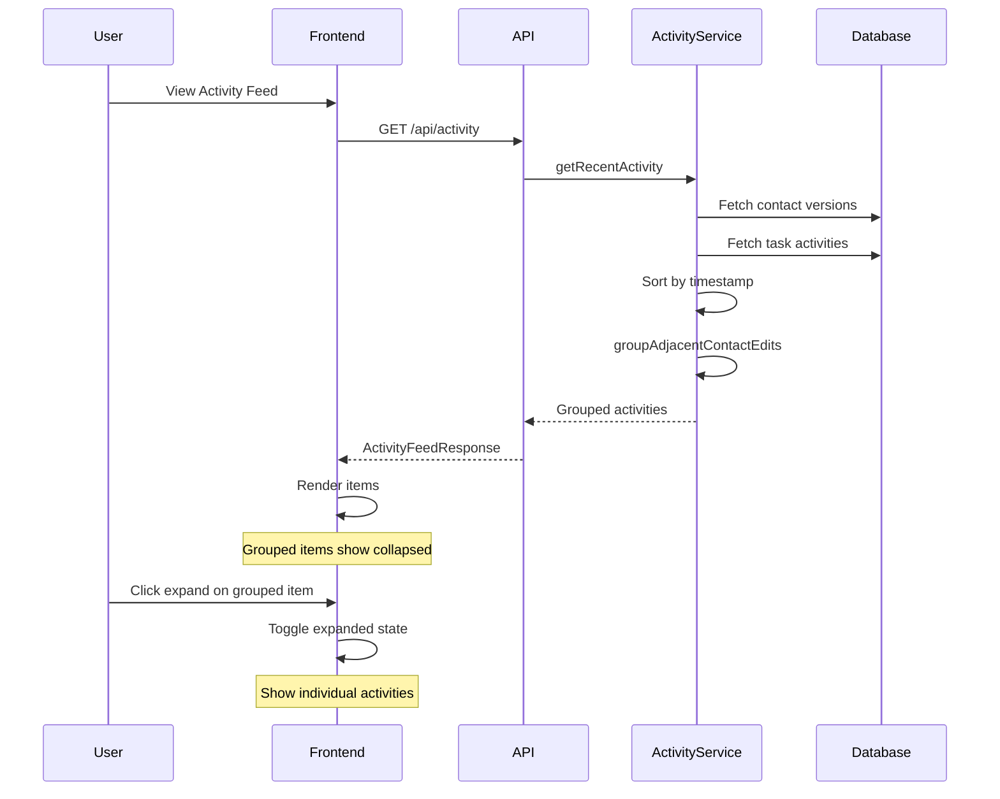

# Activity Feed Grouping Implementation Plan

## Overview

Implement collapsing of multiple consecutive activity feed stories about the same CRM contact into a single grouped story. This improves the feed's readability when a contact has multiple edits in a short time period.

## Requirements

- Group adjacent `contact_edited` activities for the same contact
- Activities must be within a 24-hour window to be grouped
- Display grouped items as "Contact Name - N updates" 
- Provide expand/collapse functionality to see individual activities
- When expanded, show all individual activities with their change details

## Architecture Decision

**Approach: Backend Grouping**

The backend will group activities before sending to the frontend. This approach:
- Reduces API payload size
- Centralizes grouping logic
- Simplifies frontend rendering
- Allows the API to return a consistent structure

## Data Structure Changes

### Backend Types (`backend/src/types/activity.ts`)

```typescript
// New: Grouped activity type
export type ActivityType = 
  | 'contact_created'
  | 'contact_edited'
  | 'contact_edited_group'  // NEW: grouped edits
  | 'task_created'
  | 'task_completed'
  | 'task_updated';

// New: Grouped contact activity info
export interface GroupedContactActivityInfo {
  id: string;
  name: string;
  editCount: number;
  activities: ActivityFeedItem[];  // Individual activities in the group
  latestTimestamp: string;
  earliestTimestamp: string;
}

// Updated ActivityFeedItem
export interface ActivityFeedItem {
  id: string;
  type: ActivityType;
  timestamp: string;
  contact?: ActivityContactInfo;
  task?: ActivityTaskInfo;
  groupedContact?: GroupedContactActivityInfo;  // NEW: for grouped items
}
```

### Frontend Types (`frontend/src/types/activity.ts`)

Mirror the backend types with the same additions.

## Implementation Steps

### Phase 1: Backend Changes

#### Step 1.1: Update Type Definitions
- Add `contact_edited_group` to `ActivityType`
- Add `GroupedContactActivityInfo` interface
- Add `groupedContact` field to `ActivityFeedItem`

#### Step 1.2: Implement Grouping Logic in ActivityService
- Create `groupAdjacentContactEdits()` method
- Modify `getRecentActivity()` to apply grouping after sorting

**Grouping Algorithm:**
```
1. Sort all activities by timestamp (descending)
2. Iterate through activities
3. For each contact_edited activity:
   a. Check if previous item is also contact_edited for same contact
   b. Check if within 24-hour window
   c. If both true, merge into group
   d. If not, start new group or keep as single item
4. Convert groups with 2+ items to contact_edited_group type
5. Return processed list
```

### Phase 2: Frontend Changes

#### Step 2.1: Update Type Definitions
- Mirror backend type changes in `frontend/src/types/activity.ts`

#### Step 2.2: Create GroupedActivityFeedItem Component
- New component: `frontend/src/components/activity/GroupedActivityFeedItem.tsx`
- Displays collapsed view: icon + "Contact Name - N updates" + timestamp range
- Expand button to show individual activities
- When expanded, renders individual `ActivityFeedItem` components

#### Step 2.3: Update ActivityFeedItem Component
- Add handling for `contact_edited_group` type
- Delegate to `GroupedActivityFeedItem` for grouped items

#### Step 2.4: Add Styles for Grouped Items
- Update `ActivityFeedItem.module.css` with grouped item styles
- Visual distinction for grouped vs single items
- Expand/collapse animation

## Component Structure

```
ActivityFeed
  |-- ActivityFeedItem (single item)
  |     |-- renderContactActivity()
  |     |-- renderTaskActivity()
  |
  |-- ActivityFeedItem (grouped item, type=contact_edited_group)
        |-- GroupedActivityFeedItem
              |-- Collapsed view (header + count)
              |-- Expanded view
                    |-- ActivityFeedItem (individual #1)
                    |-- ActivityFeedItem (individual #2)
                    |-- ...
```

## UI/UX Design

### Collapsed State
```
+--------------------------------------------------+
| [icon] John Smith - 3 updates        2 hours ago |
|        [Show details v]                          |
+--------------------------------------------------+
```

### Expanded State
```
+--------------------------------------------------+
| [icon] John Smith - 3 updates        2 hours ago |
|        [Hide details ^]                          |
|                                                  |
|   +--------------------------------------------+ |
|   | [edit] updated company                     | |
|   |        2 hours ago                         | |
|   |        [Show details]                      | |
|   +--------------------------------------------+ |
|   | [edit] updated notes                       | |
|   |        3 hours ago                         | |
|   |        [Show details]                      | |
|   +--------------------------------------------+ |
|   | [edit] updated title                       | |
|   |        5 hours ago                         | |
|   |        [Show details]                      | |
|   +--------------------------------------------+ |
+--------------------------------------------------+
```

## File Changes Summary

### Backend Files
| File | Change Type | Description |
|------|-------------|-------------|
| `backend/src/types/activity.ts` | Modify | Add grouped types |
| `backend/src/services/activityService.ts` | Modify | Add grouping logic |

### Frontend Files
| File | Change Type | Description |
|------|-------------|-------------|
| `frontend/src/types/activity.ts` | Modify | Add grouped types |
| `frontend/src/components/activity/GroupedActivityFeedItem.tsx` | Create | New component for grouped display |
| `frontend/src/components/activity/GroupedActivityFeedItem.module.css` | Create | Styles for grouped component |
| `frontend/src/components/activity/ActivityFeedItem.tsx` | Modify | Handle grouped type |
| `frontend/src/components/activity/ActivityFeedItem.module.css` | Modify | Add nested item styles |
| `frontend/src/components/activity/index.ts` | Modify | Export new component |

## Testing Considerations

1. **Unit Tests for Grouping Logic:**
   - Test grouping of 2 adjacent edits for same contact within 24h
   - Test no grouping when different contacts
   - Test no grouping when > 24h apart
   - Test no grouping when non-adjacent (task in between)
   - Test single edit remains ungrouped

2. **Frontend Tests:**
   - Test collapsed view renders correctly
   - Test expand/collapse toggle works
   - Test individual items render when expanded

## Edge Cases

1. **Single edit** - Should not be grouped, render as normal
2. **Edits > 24h apart** - Should not be grouped even if adjacent
3. **Different contacts interleaved** - Each contact's edits grouped separately
4. **Task activity between contact edits** - Breaks the adjacency, no grouping
5. **Contact created + edited** - Only group edits, not creation

## Sequence Diagram



## Implementation Checklist

- [ ] Update backend types in `backend/src/types/activity.ts`
- [ ] Implement grouping logic in `backend/src/services/activityService.ts`
- [ ] Update frontend types in `frontend/src/types/activity.ts`
- [ ] Create `GroupedActivityFeedItem.tsx` component
- [ ] Create `GroupedActivityFeedItem.module.css` styles
- [ ] Update `ActivityFeedItem.tsx` to handle grouped type
- [ ] Update `ActivityFeedItem.module.css` for nested styles
- [ ] Update `index.ts` exports
- [ ] Test grouping logic
- [ ] Test UI expand/collapse functionality
- [ ] Create PR with changes
