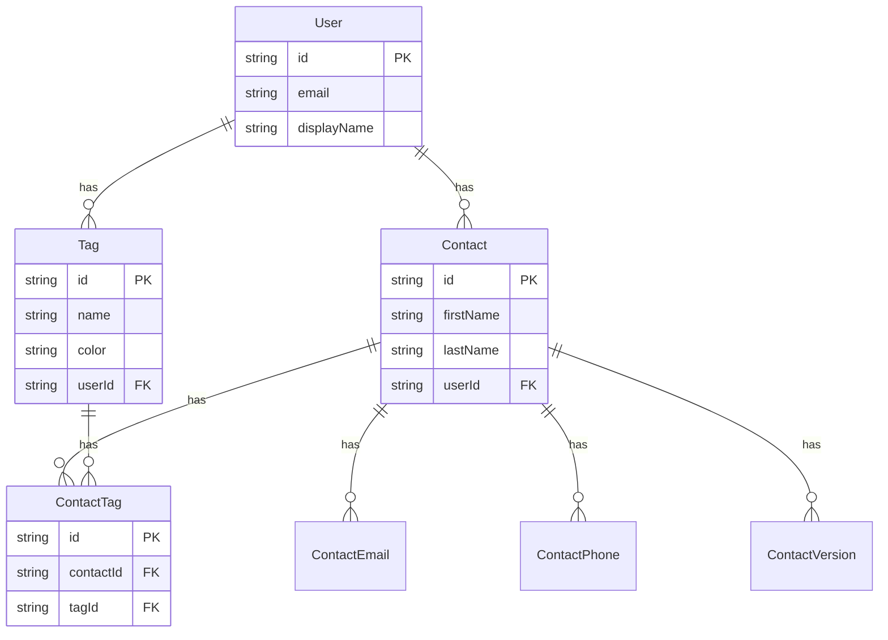

# Contact Tags Implementation Plan

## Overview

This plan outlines the implementation of a tagging system for contacts. Tags are user-specific, created inline when adding/editing contacts, and displayed as pills on contact cards in the list view and in the activity feed on the homepage.

## Requirements Summary

- Tags are user-specific (each user has their own set of tags)
- Tags are created inline only (no separate tag management UI)
- Tags display as pills on ContactCard in the contact list view
- Tags display on contact-related items in the ActivityFeed on the homepage
- No filtering by tags required (display only)
- All tags use the same color (no per-tag colors)
- No limit on number of tags per contact
- Autocomplete from existing user tags when adding tags

## Data Model Design

### Option A: Separate Tag Table with Join Table (Recommended)

This approach creates a reusable Tag entity that can be shared across contacts.

```prisma
model Tag {
  id        String   @id @default(uuid())
  name      String
  createdAt DateTime @default(now())
  
  // Relations
  userId    String
  user      User     @relation(fields: [userId], references: [id])
  contacts  ContactTag[]

  @@map("tags")
  @@unique([userId, name])  // Tag names unique per user
  @@index([userId])
}

model ContactTag {
  id        String   @id @default(uuid())
  createdAt DateTime @default(now())
  
  // Relations
  contactId String
  contact   Contact  @relation(fields: [contactId], references: [id], onDelete: Cascade)
  tagId     String
  tag       Tag      @relation(fields: [tagId], references: [id], onDelete: Cascade)

  @@map("contact_tags")
  @@unique([contactId, tagId])
  @@index([contactId])
  @@index([tagId])
}
```

**Pros:**
- Tags are normalized and reusable
- Easy to get all tags for a user (for autocomplete)
- Supports future features like tag colors, filtering, bulk operations
- Consistent with how emails/phones are modeled

**Cons:**
- Slightly more complex queries
- Requires managing tag lifecycle (orphan cleanup)

### Option B: Simple String Array on Contact

```prisma
model Contact {
  // ... existing fields
  tags String[]  // Array of tag names
}
```

**Pros:**
- Simpler implementation
- No join table needed

**Cons:**
- No tag reuse/autocomplete across contacts
- Harder to implement tag colors or metadata
- Inconsistent naming if user types same tag differently

### Recommendation

**Option A (Separate Tag Table)** is recommended because:
1. It enables autocomplete from existing tags when adding tags to contacts
2. It's consistent with the existing pattern for ContactEmail/ContactPhone
3. It supports future enhancements (colors, filtering, etc.)
4. It ensures tag name consistency across contacts

## Architecture Diagram



## Implementation Steps

### Phase 1: Backend Database and Models

#### 1.1 Create Prisma Migration
- Add Tag model to schema.prisma
- Add ContactTag join table to schema.prisma
- Add tags relation to Contact model
- Add tags relation to User model
- Run migration

#### 1.2 Update Backend Types
- Add TagDTO interface to backend/src/types/contact.ts
- Update ContactSnapshot to include tags
- Update CreateContactDTO to include tags
- Update UpdateContactDTO to include tags

#### 1.3 Create Tag Service
- Create backend/src/services/tagService.ts
- Implement findOrCreateTags method (creates tags if they do not exist)
- Implement getUserTags method (for autocomplete)
- Implement cleanupOrphanTags method (optional, for maintenance)

#### 1.4 Update Contact Service
- Update createContact to handle tags
- Update updateContact to handle tags
- Update createSnapshot to include tags
- Update computeChanges to track tag changes
- Include tags in all contact queries

### Phase 2: Backend API

#### 2.1 Update Contact Routes
- Update POST /contacts to accept tags
- Update PUT /contacts/:id to accept tags
- Ensure tags are returned in GET responses

#### 2.2 Add Tag Autocomplete Endpoint
- Add GET /tags endpoint to return user's existing tags
- Support optional search query parameter for filtering

### Phase 3: Frontend Types and API

#### 3.1 Update Frontend Types
- Add Tag interface to frontend/src/types/contact.ts
- Update Contact interface to include tags
- Update CreateContactDTO to include tags
- Update UpdateContactDTO to include tags
- Update ContactSnapshot to include tags

#### 3.2 Update Contact API Service
- Update contactApi.ts to handle tags in requests/responses

#### 3.3 Create Tag API Service
- Create frontend/src/services/tagApi.ts
- Implement getUserTags method for autocomplete

### Phase 4: Frontend Components

#### 4.1 Create TagPill Component
- Create frontend/src/components/ui/TagPill/TagPill.tsx
- Create frontend/src/components/ui/TagPill/TagPill.module.css
- Simple pill display component with optional remove button
- Support different sizes (sm for cards, md for forms)

#### 4.2 Create TagInput Component
- Create frontend/src/components/crm/TagInput.tsx
- Create frontend/src/components/crm/TagInput.module.css
- Text input with autocomplete dropdown
- Shows existing user tags as suggestions
- Creates new tags on Enter or comma
- Displays added tags as removable pills

#### 4.3 Update ContactForm
- Add TagInput component to the form
- Handle tag state management
- Include tags in form submission

#### 4.4 Update ContactCard
- Display tags as TagPill components
- Style pills to fit within card layout
- Limit visible tags with +N more indicator if needed

#### 4.5 Update ContactDetail
- Display tags in the detail view
- Style consistently with ContactCard

### Phase 5: Activity Feed Integration

#### 5.1 Update Activity Types
- Update ActivityContactInfo to include tags
- Update ContactChanges to handle tag changes

#### 5.2 Update ActivityFeedItem
- Display tags as pills for contact activities
- Show tag changes in expanded details view
- Update getFieldLabel to handle tags field

### Phase 6: Testing and Polish

#### 6.1 Backend Tests
- Test tag creation with contacts
- Test tag updates
- Test tag autocomplete endpoint
- Test tag inclusion in contact responses

#### 6.2 Frontend Tests
- Test TagPill component
- Test TagInput component
- Test ContactForm with tags
- Test ContactCard with tags

#### 6.3 Visual Polish
- Ensure consistent pill styling across components
- Test responsive behavior
- Verify accessibility (keyboard navigation, screen readers)

## File Changes Summary

### New Files
- backend/prisma/migrations/YYYYMMDDHHMMSS_add_contact_tags/migration.sql
- backend/src/services/tagService.ts
- frontend/src/services/tagApi.ts
- frontend/src/components/ui/TagPill/TagPill.tsx
- frontend/src/components/ui/TagPill/TagPill.module.css
- frontend/src/components/ui/TagPill/index.ts
- frontend/src/components/crm/TagInput.tsx
- frontend/src/components/crm/TagInput.module.css

### Modified Files
- backend/prisma/schema.prisma
- backend/src/types/contact.ts
- backend/src/services/contactService.ts
- backend/src/routes/contacts.ts
- frontend/src/types/contact.ts
- frontend/src/types/activity.ts
- frontend/src/services/contactApi.ts
- frontend/src/components/crm/ContactForm.tsx
- frontend/src/components/crm/ContactCard.tsx
- frontend/src/components/crm/ContactCard.module.css
- frontend/src/components/crm/ContactDetail.tsx
- frontend/src/components/crm/ContactDetail.module.css
- frontend/src/components/crm/index.ts
- frontend/src/components/activity/ActivityFeedItem.tsx

## UI/UX Considerations

### Tag Pills Design
- Small, rounded pills with subtle background color
- Text should be readable (good contrast)
- Optional: Support for colored tags (future enhancement)
- Remove button (x) only shown in edit mode

### TagInput Behavior
- Type to filter existing tags
- Press Enter or comma to add tag
- Click suggestion to add tag
- Backspace on empty input removes last tag
- Tags are case-insensitive for matching but preserve original case

### ContactCard Tag Display
- Show up to 3 tags inline
- If more than 3, show +N more indicator
- Tags appear below contact info section

### Activity Feed Tag Display
- Show tags inline with contact name
- In change details, show added/removed tags

## Migration Strategy

1. Deploy backend changes first (new tables, updated endpoints)
2. Existing contacts will have empty tags arrays
3. Deploy frontend changes
4. No data migration needed - tags are additive

## Future Enhancements (Out of Scope)

- Tag colors/customization
- Filter contacts by tag
- Bulk tag operations
- Tag management UI (rename, delete, merge)
- Tag suggestions based on contact data
